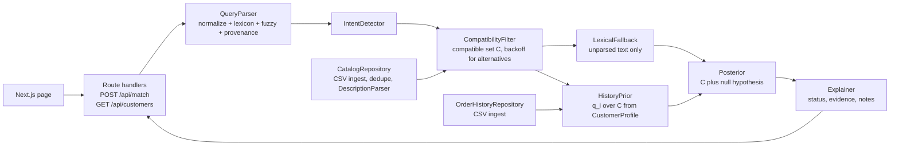
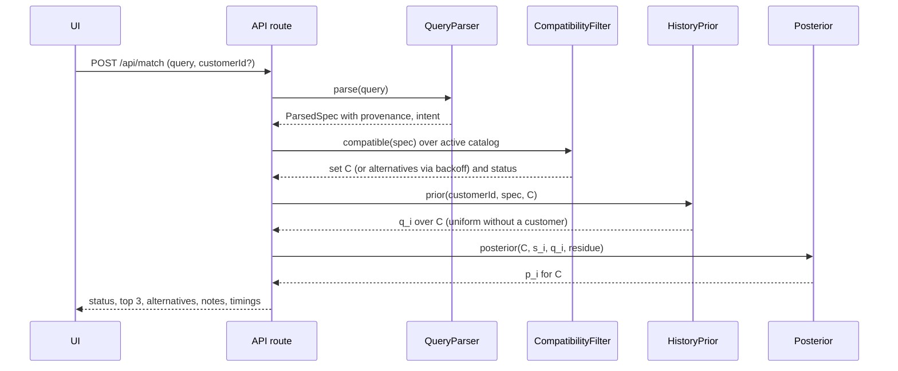

# Catalog Match: System Design

> 🎯 **Purpose.** System design for the Paragon "Catalog Match" take-home. Status: v3. v2 was revised after an external review on 2026-09-17 (section 16 lists every change); v3 is the pass of 2026-09-21 that replaced the hypotheses of the claims ledger with what the evaluation measured and the worked figures of 7.2 with their post-calibration values. Companion artifacts: the engineering brief for the coding agent and ADR-001 to ADR-005, to be written in the repository. English because this document becomes `DESIGN.md` and the basis for the live discussion.

> 📌 **How to read claims.** Statements are tagged in the ledger of section 3.4 as verified (checked against the files), hypothesis (to be tested by the evaluation) or target (a goal the implementation is measured against). The document states mechanisms and how outcomes will be measured; it does not promise outcomes.

# 1. Summary

Operational goal: help a rep or a customer pick the right SKU from a free-text description, and when that is not possible, say precisely why: which options remain and which attribute would settle it, or which requested attribute the catalog cannot satisfy. That is the unit of work inside an order-entry product such as Paragon Surge: one PO or RFQ line, one decision, made fast and explained.

The catalog is 960 unique fastener SKUs whose descriptions follow a closed grammar. The design recovers that structure with a deterministic parser, at ingest for the catalog and at query time for the customer text, computes the set of SKUs compatible with every explicit attribute in the query, and returns a match status before it returns a number: one compatible SKU, several, none (with the nearest alternatives and the constraint that failed), a history reference, or unparsed text. Confidence is the posterior of a small explicit model over the compatible set plus a "not in catalog" hypothesis. Order history enters as a prior over the compatible set only, and only through the attributes the query left unspecified. There are no embeddings, no vector store and no runtime LLM.

Key design bets:

- **Parse-and-score over similarity search.** The discriminating information is numeric (M8 vs M6, 5/8 vs 5/16, 30 mm vs 50 mm), where a parser is exact and dense embeddings are weakest. Hypothesis: tested against a normalized lexical baseline in the evaluation.
- **Match status before confidence.** A low number is never the signal for "not in catalog"; the status is. Ambiguity (several compatible SKUs) and absence (no compatible SKU) are different states with different UI, API and evaluation.
- **Confidence with stated semantics.** The number is a posterior under a model with explicit hypotheses, prior and likelihood. It is a heuristic score until calibration data exists; calibration is an empirical claim checked on single-label cases only, and the labels High, Medium and Low are set after that check.
- **History as a prior that cannot override the query.** Compatibility is decided before personalization, so an explicit attribute wins by construction, not by a rule that can be broken by weights.
- **Determinism and offline execution.** Same input, same output; no network, no keys; every behavior is a unit test.

# 2. Problem and requirements

## 2.1 Problem

Customers describe fasteners in their own words: abbreviations (SHCS, BHCS, HHB), partial attributes ("M8 flat washer", no material or finish), unit variants ("1/2 inch", "6 foot", "60mm"), attribute order permutations ("brass hex nut 1/2-13"), typos, and attributes the catalog does not carry. The catalog has descriptions only. The tool must return the three most likely SKUs with a confidence score that behaves sensibly across all of these cases, and must be explicit when the right answer is "several", "none" or "depends on the customer".

## 2.2 Functional requirements

- FR1: single page with a free-text input; on submit, the top 3 catalog matches.
- FR2: each match shows product information (SKU, description, active flag) and a confidence score.
- FR3: each response carries a match status (unique, ambiguous, none, history, unparsed) and each match an explanation: what matched and how it was recognized, what the query left unspecified, what could not be verified, and, for alternatives, which constraint was relaxed.
- FR4 (stretch): searchable customer dropdown; when a customer is selected, order history changes ranking and confidence inside the compatible set.
- FR5: correct behavior for abbreviations, missing attributes, vague or ambiguous descriptions, attributes absent from the catalog, typos, unit mismatches and out-of-catalog products.

## 2.3 Non-functional requirements

- Deterministic: same input, same output, no randomness, no wall-clock dependency.
- Offline: no network calls, no API keys, no environment variables.
- Fast: p95 under 50 ms end to end on 1,000 items, in memory (target, reported in the eval report).
- Testable: parser, compatibility, confidence and personalization covered by unit and property tests; no network in tests.
- Clean separation: UI, matching logic and data layer are independent packages with interfaces between them.
- Honest semantics: every number on screen has a formula and a stated interpretation behind it.

## 2.4 What the reviewers evaluate

- A reasonable, defensible matching approach.
- Clean separation between UI, matching logic and data layer.
- Explicit consideration of edge cases.
- A clear way of folding order history into the ranking (stretch), including new customers, sparse history and conflicting signals.
- Mature use of coding agents in the development process.

# 3. Data analysis (verified against the files)

## 3.1 Catalog

| Fact | Value | Design consequence |
|---|---|---|
| Rows and unique SKUs | 1,000 rows, 960 unique SKUs. 40 rows repeat an existing SKU with identical description and active flag and a distinct catalog_id | Dedupe by SKU at ingest, keeping the first catalog_id; never show the same SKU twice |
| Inactive | 45 rows, 44 unique SKUs (one inactive SKU is duplicated) | Excluded from the compatible set by default; surfaced only through a history note |
| Product types | 10 (86 to 103 SKUs each) | Type is a hard constraint |
| Diameters | 16: seven imperial, seven metric, two numbered (#8, #10). Each with exactly one pitch or TPI in the catalog | Diameter is a hard constraint; pitch is redundant and only validates |
| Length | Present on 100% of screws, bolts and rods; absent on 100% of nuts and washers. Units: inch mark (once omitted), FT, MM | Length nearly always disambiguates: (diameter, type, length) is unique for 654 of 668 groups |
| Materials x finishes | 6 materials (STEEL, 18-8 SS, 316 SS, A2 SS, BRASS, ALLOY) x 6 finishes (ZINC, YELLOW ZINC, MECH ZINC, HDG, PLAIN, BLACK OXIDE); all 36 combinations exist | The attributes that remain open in nut and washer queries; personalization acts here |
| Standards | 7 tokens on about 78% of rows, assigned independently of type (DIN 912 on washers, ISO 7380 on nuts) | Opaque attribute; a constraint only when the query names it; never implies a type |
| Uniqueness | (diameter, length, type, material, finish, standard) identifies every SKU; without standard, 11 pairs collide | A fully specified query resolves to one SKU |
| Noise | 74 lowercase rows; irregular whitespace; separator X or x with or without spaces; abbreviation variants (HX, SCR, WSHR, SOC, BTN, PHIL, MACH, ZN, YEL, PLN) | Normalization layer shared by catalog and query parsing |
| SKU encoding | PX + type code + digits + material code + finish code + sequence | Test oracle for the parser only, never a data source |

Every description follows one grammar:

```text
<diameter>[-<pitch>] [X <length><unit>] <type phrase> [<standard>] <material> <finish>

Examples
1/2-13 X 6FT FULL THREAD ROD STEEL ZINC
M4-0.7 X 60MM HEX CAP SCR DIN 912 STEEL YEL ZINC
5/8-11x2-1/2" BTN SOC CAP SCREW DIN 933 A2 SS YEL ZINC
#8-32 FLAT WSHR ASME B18.2.1 BRASS PLAIN
```

## 3.2 Order history

76 lines, 5 customers, 2025-07-20 to 2026-04-25. Every SKU exists in the catalog; one purchased SKU is now inactive (CUST-002, M16 hex nut 18-8 SS plain, bought 2025-12-02).

| Customer | Lines | Material | Finish | Repeat SKUs | Signal |
|---|---|---|---|---|---|
| CUST-001 Midwest Industrial Supply | 18 | STEEL 100% | ZINC majority; some yellow, mech, HDG | 1 | Strong material, moderate finish |
| CUST-002 CleanRoom Pharma MFG | 17 | 18-8 SS 100% | PLAIN 100% | 4 | Strongest profile; one purchased SKU inactive |
| CUST-003 Marine Electrical Corp | 17 | BRASS 100% | Mixed | 1 | Strong material, no finish signal |
| CUST-004 Heavy Machinery Solutions | 18 | ALLOY 100% | BLACK OXIDE 100% | 1 | Strong profile |
| CUST-005 Summit General Maintenance | 6 | 4 different | 4 different | 0 | Sparse and conflicting: the built-in edge case |

## 3.3 Example queries

Of the 33 example queries, 22 resolve to exactly one SKU once diameter, type and length are parsed. Ten are nut or washer queries with diameter and type only, leaving 2 to 9 compatible SKUs that differ only in material, finish and standard. One ("the same washers as last time") carries no attributes and is answerable only from history.

"M8 flat washer" is the personalization showcase: 7 active compatible SKUs, and the five customers resolve to four different ones. CUST-001, CUST-003 and CUST-002 each bought one of them (CUST-002 twice); CUST-005 bought the same SKU as CUST-002, once; CUST-004 never bought one and no ALLOY M8 flat washer exists, so only the finish term of the prior can act, and it points to the A2 SS black oxide washer.

## 3.4 Claims ledger

Statuses below were rewritten on 2026-09-21, after calibration (`docs/calibration.md`) and the single held-out run. Every number cites `docs/eval-report.md`, or `docs/eval-heldout.md` where it is held-out evidence.

| Claim | Status | Measured |
|---|---|---|
| Every catalog description follows the grammar above; 960 of 960 SKUs parse with the SKU encoding as oracle | Verified | `descriptionParser.catalog.test.ts` parses all 960 and cross-checks each against the SKU encoding |
| 22 of 33 example queries have exactly one compatible SKU | Verified | Re-checked by the real parser in the golden set; `queryParser.catalog.test.ts` |
| Parse-and-score outperforms a normalized lexical baseline on the golden set | **Held** | Golden set, 78 cases: Hit@1 1.000 against 0.167, exact-set rate 0.967 against 0.033, status accuracy 0.987 against 0.603 (section 10.4) |
| Sub-50 ms p95 in memory | **Held** | p95 0.4 ms over the golden set through the use case; 0.3 ms over the held-out set |
| Lexicon plus fuzzy matching covers the query classes in the example and adversarial sets | **Held on the tuned sets, and not on the held-out one** | Golden status accuracy 0.987; held-out 0.900, where the two misses are a type phrase and an intent paraphrase neither hand-enumerated list carries (`docs/eval/heldout-policy.md`) |
| Confidence is calibrated | **Not established** | The golden calibration table is degenerate: 29 of 29 single-label cases land in the top bin at precision 1.000, so only the top band has evidence. The held-out table adds 11 cases across three bins, all at precision 1.000. Neither measures the Medium or Low bands (section 10.2) |
| Strong history moves the intended SKU to top-1 with a clear margin | **Held** | Personalization Hit@1 1.000 with the customer against 0.143 without, over 21 hand-labeled pairs; mean top-1 to top-2 margin 0.328. Held-out: 1 of 2 |

> 💡 **Implications.** A closed grammar justifies a parser over a retriever for the catalog side; the query side is open language and gets tolerance (lexicon, fuzzy, provenance) instead of assumptions. Numeric discriminants rule out embeddings as the primary signal. The tie structure of nut and washer queries makes "several compatible SKUs" a normal state, not an error, so it needs its own status. History profiles are clean for four customers and noisy for one, so shrinkage must handle the noisy case without special-casing it.

# 4. Architecture

## 4.1 Components



## 4.2 Architecture style and layering rules

Hexagonal core and FSD-lite web, both enforced by lint rules rather than by folder convention.

**Core (`packages/core`) as a hexagon.** The inner ring is `domain/` (types, contracts, config), `parsing/`, `matching/` and `personalization/`: pure functions, zero framework dependencies, no knowledge of files or HTTP. `ports/` holds the three ports the design actually has: `CatalogRepository` and `OrderHistoryRepository` (driven) and `Matcher` (driving, implemented by the `matchQuery` use case). Parser and prior interfaces are inner-ring contracts, not ports: each has one implementation plus test doubles inside the ring. `application/` holds the use cases as functions (`matchQuery`, `listCustomers`) and the single composition root `createCore`, which wires the CSV adapters, the description parser and the config. `adapters/csv` and `adapters/memory` are the driven adapters. The route handlers, the eval harness, the demo script and the property tests are four driving adapters over the same port. A Postgres adapter is a folder, not a refactor.

**Rules that keep the hexagon honest.** A port exists only when it has two adapters or one adapter plus a test double in use. Use cases return plain objects. No DTO or mapper layer: the domain types are the wire types, validated once by a zod schema at the HTTP edge. No DI container, no domain events, no CQRS, no generic repository.

**Web (`apps/web`) as FSD-lite.** Next.js `app/` holds routing only: `page.tsx` composes one widget; `api/*/route.ts` are driving adapters that call `createCore`. `server/` is the only place that imports core runtime code. `src/widgets` compose features and entities; `src/features` own user actions and hooks (match-query, select-customer); `src/entities` render domain objects (match, customer) and own no fetching; `src/shared` holds the typed API client, the schema and UI primitives. A slice with a single file has no `index.ts`. Full FSD (seven layers, a public API per slice) was rejected for a one-page app: folder sprawl and explanation cost without a corresponding gain.

**Import boundaries** (eslint-plugin-boundaries or dependency-cruiser, part of `pnpm lint`; a deliberate violation must fail the build):

| Layer | May import |
|---|---|
| core inner ring (domain, parsing, matching, personalization) | inner ring only |
| core ports | domain only |
| core application | inner ring, ports; createCore is the only module that imports adapters |
| core adapters | ports, inner ring; never application |
| core eval | application, ports, inner ring; never adapters (it receives a Matcher) |
| web app | widgets, features, entities, shared, server |
| web server | the core public API only |
| web widgets, features, entities, shared | each layer imports only the layers below it in this order; shared imports nothing internal; src imports core types only, never core runtime |

- All parameters (ε, κ, k, α, partial-credit strengths, label thresholds) live in `matching/config.ts`, so a calibration change is one diff and one ADR entry.

## 4.3 Repository layout

```text
packages/core/src
  domain/            Diameter, Length, ProductType, Material, Finish, ParsedSpec, MatchStatus, Match, Explanation; contracts.ts (DescriptionParser, QueryParser, HistoryPrior)
  parsing/           normalize.ts, units.ts, lexicon.ts, fuzzy.ts, descriptionParser.ts, queryParser.ts
  matching/          compatibility.ts (set C, status, backoff), ranking.ts, posterior.ts, explainer.ts, lexicalFallback.ts, config.ts
  personalization/   customerProfile.ts, historyPrior.ts, intent.ts, historyReference.ts
  ports/             catalogRepository.ts, orderHistoryRepository.ts, matcher.ts
  application/       matchQuery.ts (use case, implements Matcher), listCustomers.ts, createCore.ts (composition root)
  adapters/csv/      csv.ts, csvCatalogRepository.ts, csvOrderHistoryRepository.ts
  adapters/memory/   inMemoryCatalogRepository.ts, inMemoryOrderHistoryRepository.ts (test doubles, generators)
  eval/              loader, metrics, baseline runner, report (driving adapter over the Matcher port)
  index.ts           public API
apps/web
  app/               page.tsx (composes the widget); api/match/route.ts, api/customers/route.ts (driving adapters)
  server/core.ts     createCore({ dataDir }) once per process; stub injection for tests
  src/widgets/results-panel
  src/features/match-query, src/features/select-customer
  src/entities/match, src/entities/customer
  src/shared/api (client, schema, example queries), src/shared/ui
data/                catalog.csv, order_history.csv, eval/golden.jsonl, eval/heldout.jsonl
docs/                DESIGN.md (this document), adr/, eval-report.md, eval-heldout.md, ASSUMPTIONS.md, DEMO.md, RUNBOOK.md, calibration.md
scripts/             profile.ts (reproduces section 3), eval.ts, demo.ts
```

## 4.4 Request flow



# 5. Matching pipeline

## 5.1 Normalization (shared by catalog and query)

Lowercase; collapse whitespace; unify quote characters to the inch mark; ASCII fractions for unicode ones; unit aliases (inch, in to `in`; foot, feet, ft to `ft`; millimeter, millimetre to `mm`); `#`, `no.` and `number` before a digit to `#`; separators X or x with or without spaces to a canonical separator; singularize type nouns; strip quantities and noise tokens (pcs, qty, each, please, quote).

## 5.2 Parsing

The catalog parser and the query parser share the lexicon but differ in tolerance: the catalog parser is strict and must reach 100% coverage (tested against the SKU encoding); the query parser is permissive and records, for every attribute, how it was obtained.

**Provenance per attribute**, exposed in the API and the UI: `explicit` (stated in the query), `inferred` (derived by a rule, such as inches for an imperial diameter), `corrected` (fuzzy match, with the original token), `approximate` (used only for alternatives, such as a length within tolerance), `unrecognized` (residue).

- **Diameter.** Metric `m(digits)`, imperial fraction, numbered `#(digits)`, each optionally followed by a pitch or TPI. A bare number with a mm unit ("12 millimeter", "12mm") counts as a metric diameter when it is the first size token or when the type takes no length (nuts, washers); it is a length when it follows the separator or another diameter. A parse is `known` only when the nominal is one of the 16 catalog diameters; M14 or a non-catalog pitch such as 1/2-20 parse as unknown and produce status none, never a silent drop.
- **Length.** Preferred: the token after the separator (left is the diameter, right is the length). Otherwise a number attached to a unit (60mm, 1 inch, 6 foot). Otherwise a trailing number after the type phrase ("tap bolt 5/8", "machine screw 1-1/4"). Mixed numbers such as 1-1/4 and fractions such as 3/4 are always inches; whole numbers without a unit take the diameter's system (mm for metric, inches otherwise, provenance inferred). A metric diameter with an inch length, or the reverse, is a `unitMismatch` note: the length is kept as stated and converted for the approximate search of alternatives.
- **Type.** Longest match over a lexicon of canonical phrases and abbreviations. Hex-head terms (hex bolt, HHB, hex head bolt) cover the hex-head family: hex cap screw and tap bolt, both at full strength, because a tap bolt is a fully threaded hex bolt; the explanation names the type actually matched. Generic terms yield several candidates with strengths: "washer" alone is flat and lock at 0.6; "bolt" alone is hex cap screw, tap bolt and lag screw at 0.5.
- **Material and finish.** Lexicon with families: stainless, ss and inox match the stainless family (18-8, 316, A2) at 0.8; 304 maps to 18-8; a4 maps to 316; galvanized and hot dip map to HDG; zinc plated maps to ZINC; black alone maps to BLACK OXIDE at 0.7.
- **Fuzzy matching.** Unknown alphabetic tokens of 4 or more letters map to the closest lexicon word within Damerau-Levenshtein distance 1 (distance 2 from 8 letters), except tokens that already are lexicon words or protected codes (ss, zn, hdg, din, iso, nut, hex, lag). "nutt" to nut, "haed" to head, "washr" to washer all qualify. Corrections carry strength 0.9 and provenance `corrected`. This is the deterministic replacement for a runtime LLM interpreter.
- **Residue.** Every token not understood (nylon, grade 8, left hand, red) is kept with provenance `unrecognized`. Residue never changes which SKUs are compatible; it lowers every confidence through the null hypothesis and appears in the UI as "not verifiable".

## 5.3 Compatible set and match status

The query's explicit and inferred attributes are constraints. A catalog item is **compatible** when it satisfies every constraint exactly or at family level (stainless family, zinc family, hex-head family). Partial credits from weak or fuzzy terms keep the item compatible; contradictions do not: an item that contradicts any specified attribute, standard included, is outside the compatible set C.

Status is decided by C and by the parse, before any number is computed:

| Status | Condition | Response |
|---|---|---|
| unique | C has exactly one item | One match with posterior confidence; two nearest alternatives may follow, labeled as such |
| ambiguous | C has two or more items | Top 3 of C by posterior; size of C and the attributes that vary inside C; personalization reorders C |
| none | C is empty (unknown diameter or type, length or standard not in catalog, contradictory combination) | No confidence; the failed constraint named; up to 3 alternatives from backoff (section 5.6), each with the relaxed constraint stated |
| history | Intent detector fires (section 7.4) | History-derived candidates, or a prompt to select a customer |
| unparsed | Neither diameter nor type recognized | Lexical fallback, confidence capped at 0.4, status shown |

This is what makes "explicit attributes always win" a structural guarantee rather than a weighting: nothing outside C is ever ranked with C, and personalization only sees C.

## 5.4 Ranking inside the compatible set

```text
s_i = Π_a c_a(q, i),   a ∈ {diameter, type, length, material, finish, standard}

c_a = 1                 attribute unspecified in the query, or exact agreement
c_a = 0.8               family agreement (stainless vs a specific SS, zinc family vs a specific zinc, hex-head family)
c_a = term strength     weak or fuzzy terms (0.5 to 0.9)
```

Contradictions do not appear here because contradicting items are not in C. The partial credits only order compatible items: an exact material match ranks above a family match, a clean type term above a fuzzy one.

## 5.5 Confidence as a posterior under an explicit model

```text
Hypotheses   H = C ∪ {null}                 null = "the intended product is not in this catalog"
Prior        P(null) = ε                     ε = 0.02 initially
             P(i)    = (1 − ε) · q_i          q_i = customer prior over C (section 7.2); uniform 1/|C| without a customer
Likelihood   L(i)    = s_i                    section 5.4
             L(null) = κ^|residue|            κ = 3: every unrecognized token is evidence for null
Posterior    p_i = (1 − ε) · q_i · s_i  /  [ (1 − ε) · Σ_j∈C q_j · s_j  +  ε · κ^|residue| ]

Worked values (no customer):
  unique, no residue            p = 0.98
  unique, two residue tokens    p = 0.98 / (0.98 + 0.18) = 0.84
  ambiguous, 7 compatible       p ≈ 0.14 each
```

Semantics, stated on the page and in the README: `p_i` is the model's estimate that SKU i is the intended one, given the query, the customer and the assumptions above. The parameters ε and κ are set by hand; the model is small and explicit so the estimate can be checked. Whether the numbers are calibrated is measured on single-label cases (section 10.2), and with the size of this golden set the answer will be coarse. The labels High, Medium and Low are attached after that measurement; initial thresholds 0.70 and 0.35 are placeholders in the config, not claims.

Why this form: it gives one number with one interpretation; ambiguity is visible in the value (seven compatible items cannot each be likely); residue lowers every value without reordering; strong history can raise one item of an ambiguous set to a high value through q_i, which is the behavior a rep expects when a customer always buys the same washer. Raw cosine similarity is uncalibrated and compressed; a softmax over candidates hides absolute quality; an LLM-judged score is opaque and non-deterministic.

## 5.6 Alternatives when nothing is compatible

Status none still shows up to three items, found by relaxing constraints in a fixed order and stopping at the first non-empty step: (1) drop the standard; (2) widen material and finish to their families; (3) allow an approximate length, within 25% of the requested value after unit conversion, ranked by distance; (4) drop the length. Diameter and type are never relaxed: a query for M14 or for a carriage bolt returns status none with no alternatives beyond a note. Alternatives carry no confidence; they carry a closeness value (satisfied constraints over specified constraints) and the relaxed constraint in their explanation. Example: "M8 x 45mm SHCS" has eight active M8 socket head cap screws and none at 45 mm; the response is status none, "no M8 socket head cap screw at 45 mm", with the 40 mm and 50 mm items as approximate alternatives if they exist, else the nearest lengths.

## 5.7 Explanation

Every match returns: the status; matched attributes with query value, item value and provenance; unspecified attributes; unverified residue tokens; the size of C and the attributes that vary inside it; for alternatives, the relaxed constraint and the closeness value; and, when a customer is selected, the personalization reason (bought n times, last order date, material and finish shares).

## 5.8 Lexical fallback and baseline

When the parser finds neither a diameter nor a type, the attributes it did recognize still constrain: the candidates are the compatible set C, and token overlap over normalized description tokens (an in-repo BM25-lite) only orders them, with confidence capped at 0.4 for the best item the pool admits and status unparsed. When those attributes admit nothing, there is no honest lexical answer and the query falls through to the backoff of section 5.6: status none, the failed constraint named, alternatives carrying closeness rather than a confidence. The same component, run alone over every golden query, is the baseline that the parse-and-score hypothesis is measured against (section 10.4); the baseline scores the whole active catalog unfiltered, because what it exists to measure is what pure lexical matching achieves.

# 6. Behavior across the challenge's edge cases

| Case | Example | Status | Mechanism and expected outcome |
|---|---|---|---|
| Abbreviation or shorthand | SHCS 7/16 x 2-1/2; M8 x 50mm BHCS | unique | Lexicon expansion; identical result to the expanded form; p near 0.98 |
| Shorthand covering a family | HHB 3/4-10 x 5/8 | unique | Hex-head family; the only item at that size is a tap bolt; explanation says so |
| Missing attributes | M8 flat washer | ambiguous | 7 compatible; about 0.14 each; banner "7 options, specify material or finish" |
| Vague text | big brass bolt | unparsed or ambiguous | "bolt" yields three types at 0.5, brass explicit; large C, low values; explanation lists what would disambiguate |
| Attribute not in catalog | M8 hex nut nylon insert; grade 8 1/2-13 hex nut | ambiguous | Residue raises the null term; same C and order as without the token; lower values; "not verifiable: nylon" |
| Product not in catalog: size | M8 x 45mm SHCS | none | Length not in catalog; failed constraint named; approximate-length alternatives |
| Product not in catalog: diameter or type | M14 hex nut; carriage bolt 3/8 | none | Unknown diameter or type; note only, no alternatives |
| Unit and format variants | 1/2 inch hex nut; 1/2 rod 6 foot; 12 millimeter hex nut | ambiguous or unique | Normalization and unit inference; 12 millimeter read as M12 with provenance inferred |
| Typos | washr; hex nutt; socket haed | as the corrected query | Fuzzy at 0.9 with the correction shown |
| Unit mismatch inside the query | M8 x 3/4 hex cap screw | none | 3/4 read as inches, note unitMismatch; no M8 at 19.05 mm; 20 mm item as approximate alternative |
| Explicit standard | M8 flat washer DIN 912 | unique | Standard is a constraint when named; the A2 SS black oxide washer is the only compatible item, whatever the customer's history |
| Fully specified | 1/4-20 x 3/4 hex cap screw zinc | unique | All attributes agree on one SKU; p near 0.98 |

# 7. Personalization (stretch)

## 7.1 Customer profile

Each history line is parsed with the same parser (cross-checked with the SKU) and weighted by recency, with age measured from the latest date in the file so the demo is stable. The profile holds recency-weighted, smoothed distributions over material, finish and thread system, plus per-SKU repeat weights.

## 7.2 Prior over the compatible set

```text
w_line   = exp(−age_days / τ),   τ = 180 days
n_eff    = Σ w_line                                   effective history size
λ_c      = n_eff / (n_eff + k),   k = 5                shrinkage; λ_c = 0 for an unknown or unselected customer
P(v | c) = (Σ w_line · [attribute = v] + α) / (n_eff + α · V)     α = 1, V = number of catalog values of the attribute
h_i      ∝ (1 + w_sku · repeat_i) · Π_{a unspecified in the query} P(a_i | c)      normalized over C; w_sku = 2; repeat_i = recency-weighted purchases of SKU i, capped at 1, and at least 0.5 for an active item sharing diameter, type and material family with a discontinued purchased SKU
q_i      = λ_c · h_i + (1 − λ_c) / |C|                  the prior used in section 5.5
```

The prior is a distribution over C: a mixture of the history-derived distribution and the uniform one, weighted by how much history there is. It contains no free scale parameter that could be tuned to promise a label; the only parameters are the recency horizon, the shrinkage constant and the smoothing pseudo-count.

Worked figures for "M8 flat washer" and CUST-002, measured by the profile builder over the real file at the calibrated α of 1: n_eff 8.29 of 17 lines after recency weighting, λ_c 0.62, material and finish shares for 18-8 SS and plain 0.65, the SS plain washer bought twice gets repeat weight 1. Measured over the seven active M8 flat washers, q gives that washer 0.645 against 0.075 for the next one, a margin of 8.6x, and its posterior comes out at 0.632 against 0.073. For CUST-004, where no washer is alloy, only the finish share acts and the A2 SS black oxide washer reaches 0.457 in q against 0.090 for every other, a posterior of 0.448 against 0.089. Both land in the Medium band under the thresholds calibration measured (0.35 and 0.8); only a `unique` answer reaches High, which is the point of section 5.3.

For CUST-005, n_eff is 2.71 and λ_c 0.35, and the mixture stays close to uniform: q spreads only from 0.178 to 0.114, a 1.1x spread across the seven. The single earlier purchase of the 18-8 SS plain washer does carry it to the top, but by 0.174 against 0.165 in the posterior — a lead of half a point, not a separation. Six lines across four materials and four finishes leave every share near its smoothed floor, so the repeat term is the only thing that moves, and it moves very little. That is the shrinkage doing its work, not a defect, and it is why the sparse case is tested for near-uniformity rather than for a winner.

> 📌 α moved from 0.5 to 1 in calibration (`docs/calibration.md`). At 0.5 this customer's six lines were confident enough about material to rank a brass washer above the one they had actually bought; add-one smoothing flattens a sparse profile and lets the repeat term decide. The figures above are the post-calibration ones; the pre-calibration text quoted a 0.188–0.105 spread.

## 7.3 Rules

- Personalization sees only C. An item outside C cannot be promoted by history, so an explicit attribute in the query wins by construction. "brass hex nut 1/2-13" for CUST-004 returns brass items only; the explanation adds "history prefers alloy black oxide; overridden by the query".
- A prior term applies only to attributes the query left unspecified: if the query says brass, the material factor is dropped from h_i.
- Sparse or conflicting history is handled by λ_c and by the smoothed shares: CUST-005 has a small n_eff and near-uniform shares, so the mixture stays close to uniform.
- An inactive history item is never in C. The response adds the note "previously ordered PXNUT16888PL0901 is discontinued; showing closest active", and compatible items sharing diameter, type and material family receive repeat weight 0.5 in h_i.

## 7.4 Intent: history references

Triggers on phrases such as same, last time, usual, again, reorder, like before, what we always get, previous order. With a customer selected, the referenced order lines are those customer's most recent lines whose type, diameter or pitch matches any such words in the query ("washers" covers flat and lock washers). Two forms:

- Pure reference ("the same washers as last time"): status history; candidates are the referenced lines ranked by recency, confidence 0.7 for the most recent decaying by rank, with the order date and quantity in the explanation.
- Reference with an override ("same washers as last time, but brass"): the referenced line's parsed attributes become the base specification, the query's explicit attributes overwrite it (material becomes brass), and the merged specification runs through the normal pipeline with status derived from C; the note says "based on your 2026-04-15 order, material changed to brass".

Without a customer, the response carries no matches, status history and the note "select a customer to resolve 'last time'"; if the query also carries attributes, the attribute path runs and the note stays.

## 7.5 Edge cases

| Case | Example | Expected behavior (labels decided by calibration) |
|---|---|---|
| New or unselected customer | M8 flat washer, no customer | λ_c = 0; identical to the base result |
| Strong profile with a repeat purchase | M8 flat washer, CUST-002 | 18-8 SS plain washer top-1 with a clear margin; reason "bought 2x, last 2026-04-15" |
| Profile without a compatible material | M8 flat washer, CUST-004 | No alloy M8 flat washer; only the finish share acts; A2 SS black oxide washer top-1 with a small margin; explanation says material could not be matched |
| Sparse and conflicting history | M8 flat washer, CUST-005 | Small λ_c; the prior stays close to uniform (q from 0.178 to 0.114) and no item separates from the rest |
| Conflict between query and history | brass hex nut 1/2-13, CUST-004 | Brass items only; override shown in the explanation |
| Explicit standard against a repeat purchase | M8 flat washer DIN 912, CUST-002 | Unique: the DIN 912 washer; the ISO 7380 washer bought twice is outside C and cannot appear above it |
| Discontinued history item | M16 hex nut, CUST-002 | Inactive SKU excluded; discontinued note; stainless-family nut gets repeat weight 0.5 |
| History reference without a customer | the same washers as last time | Status history, no matches, prompt to select a customer |
| History reference with an override | same washers as last time, but brass | Base specification from the referenced line, material overwritten, normal pipeline |

# 8. Data layer and API

## 8.1 Data layer

`CsvCatalogRepository` loads catalog.csv once at startup, dedupes by SKU, normalizes and parses every description into a `CatalogItem` with structured attributes, and keeps the original text for display and lexical fallback. `CsvOrderHistoryRepository` loads order_history.csv and exposes lines per customer and the customer list. Both implement interfaces so a database-backed implementation is a drop-in replacement.

## 8.2 API contract

```text
POST /api/match
  body   { query: string; customerId?: string; limit?: number }        // limit defaults to 3
  200    { query; parsed: ParsedSpec;                                    // every attribute with provenance
           status: 'unique' | 'ambiguous' | 'none' | 'history' | 'unparsed';
           compatibleCount: number;
           results: Match[];                                            // empty when status is none
           alternatives: Alternative[];                                 // filled when status is none, optional otherwise
           notes: string[];                                             // failed constraint, unitMismatch, discontinued item, prompts
           timingsMs: { parse; match } }
  400    empty or whitespace-only query
  never 500 on unparseable text: status unparsed with the lexical path

Match        { sku; catalogId; description; active; confidence: 0..1; label?: 'High' | 'Medium' | 'Low';
               explanation: Explanation; components: { compatibility: s_i; prior: q_i } }
Alternative  { sku; catalogId; description; active; closeness: 0..1; relaxed: string[]; explanation: Explanation }

GET /api/customers?q=
  200    { customerId; customerName; orderCount; lastOrderDate }[]      // prefix and substring match on id and name
```

# 9. UI

Single page: free-text input (Enter submits), searchable customer combobox (id, name, order count), a status line first ("1 match", "7 compatible options, specify material or finish", "No M8 socket head cap screw at 45 mm; nearest lengths below", "Select a customer to resolve 'last time'"), then up to three cards: description, SKU, active badge, confidence bar with label for matches or closeness with the relaxed constraint for alternatives, chips for matched (with provenance), unspecified and unverified attributes, and a personalization note when present. Example-query chips built from the 33 example queries support the live demo. The page holds no matching logic; it only calls the API. Structure: FSD-lite as in 4.2, the page composes one widget, features own the user actions, entities render domain objects, shared holds the typed client and primitives.

# 10. Evaluation strategy

## 10.1 Data sets

- **Golden set** (`data/eval/golden.jsonl`): query, optional customer, expected status, expected compatible set or single expected SKU, tags. Seeded with the 33 example queries: the single SKU for attribute-complete queries; the full active compatible set for tie queries; personalized expectations per customer written by hand before any tuning, with the reasoning recorded next to each. Plus at least 20 adversarial cases: unknown diameter, type or length; residue attributes; synonyms; unit forms and mismatches; typos; noise; casing; attribute order permutations; explicit standards; history references with and without a customer and with an override.
- **Held-out set** (`data/eval/heldout.jsonl`): 15 to 20 paraphrases and adversarial cases frozen before parameter tuning, run once at the end and reported separately. Never used to adjust the lexicon or the parameters.

## 10.2 Metrics, one per claim

| Claim | Metric | Cases |
|---|---|---|
| Retrieval of the intended SKU | Hit@1, Hit@3, MRR against the single expected SKU | Single-label queries only (attribute-complete and hand-labeled personalized) |
| Recovery of the compatible set | Set precision and recall of C against the expected set; exact-set rate | Tie queries |
| Status correctness | Confusion matrix over unique, ambiguous, none, history, unparsed | All queries |
| Constraint preservation | Number of returned matches contradicting an explicit attribute; must be 0, also as a property test over generated queries | All queries, with and without a customer |
| Personalization | Hit@1 with vs without a customer; margin between top-1 and top-2 | Hand-labeled (query, customer) pairs |
| Calibration | Bins of top-1 confidence vs empirical top-1 precision, with the count per bin | Single-label queries only; never tie queries, where "acceptable" and "intended" are different events |

## 10.3 Reporting

`pnpm eval` prints the tables and writes `docs/eval-report.md`; `--heldout` writes `docs/eval-heldout.md` beside it, so the frozen set's single run cannot be overwritten by a later golden run. Both carry bin counts and the number of cases behind every number. The README states that these are limited evidence from a small labeled set: they support the design choices for this data, they do not establish calibration or generalization. CI fails when status correctness or constraint preservation on the golden set drops below the committed baseline.

## 10.4 Baseline comparison

The lexical fallback run alone over every golden query is the baseline. The report shows retrieval, set recovery and status correctness for both approaches side by side; that comparison is the evidence for the parse-and-score choice, in place of the assertion.

## 10.5 Circularity, acknowledged

Personalized expectations are written by a person looking at the same history the algorithm uses; there is no independent ground truth for what a customer meant. The mitigation is procedural: expectations written before tuning, reasoning recorded, held-out cases untouched, and constraint preservation measured independently of any label.

# 11. Alternatives considered

| Option | Why not for this task | Revisit when |
|---|---|---|
| Embeddings-first (dense retrieval, optional rerank) | Weak on numeric tokens, the only discriminant here; needs an API or a local model; uncalibrated scores; harder to explain | A real catalog with long free-text descriptions where the parser drops below roughly 95% coverage |
| BM25 only | Misses M8 vs M8-1.25, inch vs mark, SHCS vs socket head cap screw without the same normalization work; no notion of a constraint | Kept as the fallback and as the baseline |
| LLM-only ("pick the top 3") | Non-deterministic, no eval loop, opaque confidence, latency and cost | Never as the primary matcher |
| LLM query interpreter behind a flag | Parser plus fuzzy matching covers the query classes in scope; a flag adds an untested path and a demo dependency | Eval shows a residue-heavy query class the lexicon cannot absorb |
| Soft penalties for contradictions inside one score | Lets weights or history rank a contradicting item above a compatible one and lets many near-misses outweigh the null hypothesis (the M8 x 45mm case) | Not revisited: replaced by the compatible set and status |
| Null detection by a confidence threshold | Cannot separate "seven valid options" from "no valid option"; both sit below any threshold | Not revisited: replaced by status |
| Additive history boost with tunable weights | Its maximum boost is bounded by the weights, so a promised label can be unreachable; no probabilistic reading | Not revisited: replaced by the mixture prior |
| Vector database or Postgres | 960 items fit in memory; infrastructure without signal | Catalog size or multi-tenant requirements |
| Separate NestJS API | Ceremony without signal: the package boundary already demonstrates the separation | Independent deployment or scaling of the API |
| Personalization by embedding centroid or co-purchase | 76 history lines; attribute-level shares are transparent and explainable | History large enough to estimate item-item statistics |

# 12. Risks and mitigations

| Risk | Mitigation |
|---|---|
| Confidence read as a calibrated probability | Semantics stated on the page; calibration table with bin counts; labels attached after measurement; README caveat |
| Over-fitting the lexicon and parameters to the example queries | Held-out set frozen before tuning; adversarial cases; property tests instead of per-query tuning |
| Parser ambiguity between thread and length (1-1/4 vs 1/4-20; 12mm as diameter or length) | Fixed rules in 5.2 with provenance; tests for every form in the catalog and the example set |
| Personalization overriding an explicit attribute | Structural: prior applies inside C only; constraint-preservation metric and property test |
| Ambiguity mistaken for absence | Distinct statuses in API, UI and evaluation; status confusion matrix |
| Scope creep into the stretch before the base is solid | Phase gates; base eval tables committed before personalization starts |

# 13. Production path

What would change with a real distributor's data, in the order it would matter:

1. Feedback loop: log every query, status, compatible set, posteriors and the rep's accepted SKU; fit ε, κ, the shrinkage and the label thresholds from acceptance data instead of by hand.
2. Catalog scale and drift: move repositories to Postgres, precompute parsed attributes at ingest, re-parse on catalog updates, and monitor parser coverage as a metric.
3. Long-tail language: add LLM-based structured extraction for queries that end mostly as residue, and document expansion for messy descriptions, both measured against the same golden and held-out sets before being switched on.
4. Multi-line documents: the same matcher applied per line of a PO or RFQ, with document-level context (a whole order in stainless) as an additional prior term.
5. Observability: parse coverage, status distribution, size of C, null share and acceptance rate as dashboards.

# 14. Delivery plan and demo

1. Phase 0: scaffold, CSV ingest with dedupe, profiling script that reproduces section 3.
2. Phase 1: normalization, units, lexicon, fuzzy matching, both parsers with provenance, tests first. Gate: 960 of 960 rows parsed and cross-checked; all 33 example queries parsed as intended.
3. Phase 2: compatibility filter, status, ranking, posterior, alternatives, explainer, lexical fallback, API, eval harness with golden set, held-out set frozen. Gate: base eval tables including the baseline comparison.
4. Phase 3: UI with status line and example chips.
5. Phase 4: personalization and intent detection, hand-labeled personalized cases written before tuning. Gate: eval tables with lift, margins and conflict cases; calibration table.
6. Phase 5: README, `DESIGN.md`, ADRs, assumptions, demo script, CI.

Demo script for the call: a fully specified query (unique); "M8 flat washer" without a customer (ambiguous, banner), then with CUST-002, CUST-004 and CUST-005; "M8 flat washer DIN 912" with CUST-002 (constraint beats history); "brass hex nut 1/2-13" with CUST-004 (conflict); "M16 hex nut" with CUST-002 (discontinued item); "M8 x 45mm SHCS" (none, approximate alternatives); "M14 hex nut" (none); "the same washers as last time" without and with a customer, then "but brass"; the eval tables with the baseline; and one case the system gets wrong, with what the fix would be.

# 15. Assumptions and open questions

- Duplicate catalog rows are the same product; dedupe by SKU, first catalog_id kept.
- Inactive items are not sellable; hidden by default; surfaced only through a history note.
- Standard tokens never imply a product type; a standard named in the query is a constraint like any other.
- Pitch is redundant with diameter in this catalog; a non-catalog pitch marks the diameter as unknown.
- A2 SS is a stainless-family sibling of 18-8, not the same material.
- Recency is measured from the latest date in the history file, not from the wall clock.
- Open: whether to show inactive items on explicit request (a toggle) or never; whether the ambiguity banner should offer refinement chips (material, finish) instead of text only; whether alternatives should also be listed under status unique when C has one item but close siblings exist.
- Open, and reached in practice: which attributes of the referenced order survive a history override (7.4). Read literally the base specification carries its standard and its finish, so "same washers as last time, but brass" returns nothing, because no brass ISO 7380 M8 flat washer exists. The implementation drops the standard and keeps the finish, which returns one washer; the golden label `pers-21` expects both dropped, which returns two. This is the one golden case still failing and it is a specification question, not a defect: the rule has to be stated here before the code can be said to be right.
- Open: both hand-enumerated vocabularies — the type phrases the catalog does not stock (5.3) and the intent phrases (7.4) — cover what their authors thought of and no paraphrase beyond it. The held-out run found one of each (`square head set screw`, `on the last order`). Section 13 names the production answer: structured extraction for queries that end mostly as residue, measured against these same sets.

# 16. Changes after review (2026-09-17)

| Review point | Resolution | Where |
|---|---|---|
| Confidence called a posterior without a sufficient model; the promised High for CUST-002 was unreachable with the additive prior (upper bound about 53%) | Explicit model with hypotheses, prior, likelihood and posterior; additive boost replaced by a mixture prior that is a distribution over C; labels attached after calibration; worked estimate given as an expectation, not a promise | 5.5, 7.2, 7.5, 3.4 |
| Ambiguity confused with absence; soft contradiction mass could outweigh the null (M8 x 45mm SHCS gave the null 4.76%); a confidence threshold cannot separate the two | Compatible set C with no contradictions; match status decided before any number; status none with backoff alternatives and no confidence; status correctness measured by a confusion matrix | 5.3, 5.6, 8.2, 9, 10.2 |
| "Explicit attributes always win" not guaranteed because contradictions kept positive scores; DIN 912 counterexample; "but brass" undefined | Personalization sees only C, so the guarantee is structural; a named standard is a constraint; history reference with override defined as base specification plus overwrite | 5.3, 7.3, 7.4, 7.5 |
| Evaluation could confirm its own rules; Hit@1 on accepted sets trivial; calibration mixed two events; personalization labels circular | One metric per claim; set recovery for tie queries; calibration on single-label cases only; hand-labeled personalized cases written before tuning; held-out set; baseline comparison; circularity acknowledged | 10.1 to 10.5 |
| Parser promises beyond the rules: 4-letter typos, "12 millimeter" as a diameter, "M8 x 3/4", HHB with no hex cap screw at that size | Fuzzy from 4 letters with a protected list; mm-number diameter rule; fractions always inches with a unitMismatch note; hex-head family alias; provenance per attribute | 5.2, 6 |
| Factual errors: 17 lines for CUST-002 and CUST-003; duplicates differ in catalog_id; 44 inactive SKUs; CUST-005 has no repeat SKU; CUST-002 and CUST-005 share the M8 washer SKU | All corrected | 3.1, 3.2, 3.3 |
| Claims presented as verified when they were hypotheses or targets; document should open with the operational goal | Claims ledger; summary opens with the operational goal and the link to the order-entry use case | 1, 3.4 |
| Architecture style of the applications was implicit (owner's question, 2026-09-17) | Hexagonal core with lint-enforced ring boundaries, three ports (two repositories and the Matcher) and one composition root; FSD-lite web with downward-only imports; full FSD and a DI container rejected as ceremony | 4.2, 4.3, 9 |

[Parallel Execution Plan: Catalog Match (PRG)](https://app.notion.com/p/3deb7ef148b48125857cdcb7fef94b68)
